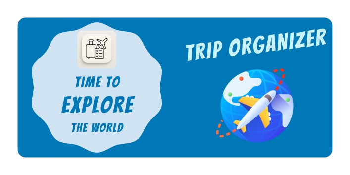
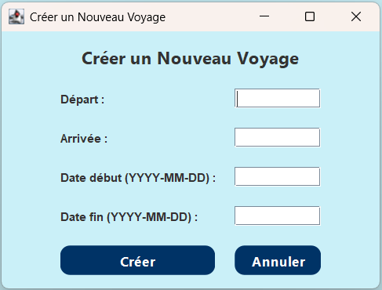
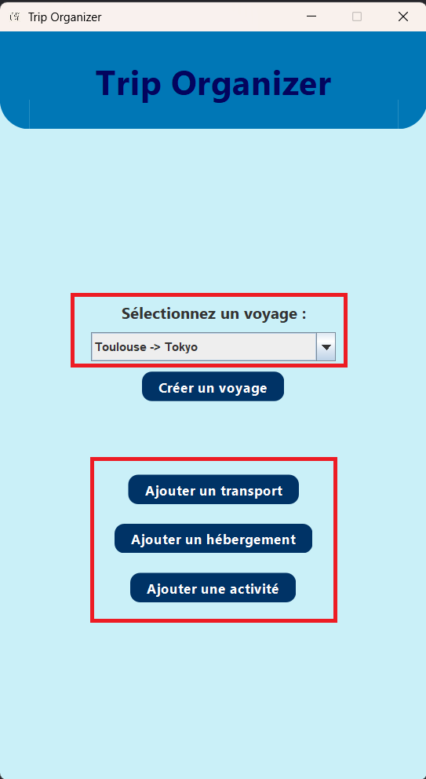
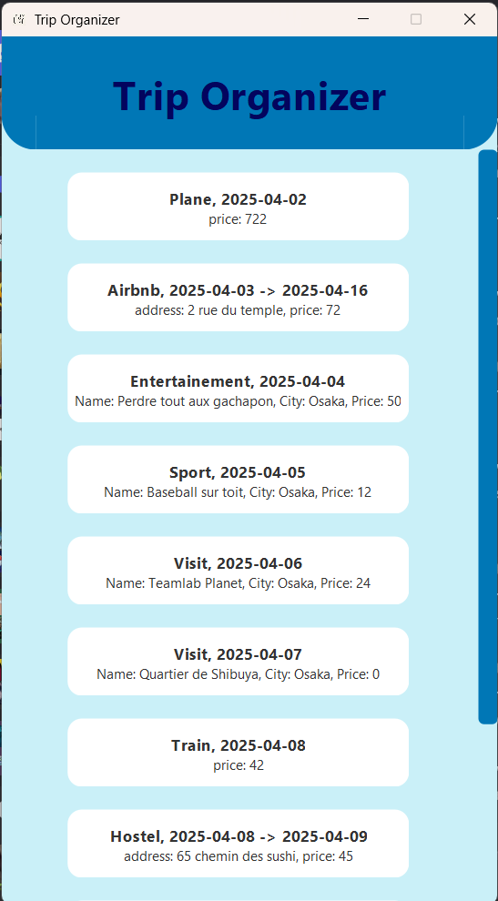
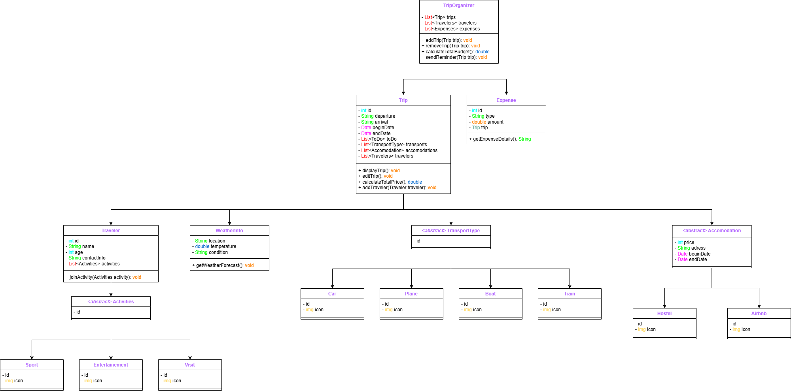

<p align="center">
    
</p>

___

## Table of contents : 

1. [Trip Organizer]()
2. [Installation]()
3. [Features]()<br>
    3.1 [Create and edit a trip]() <br>
    3.2 [See the trip details in timeline]()
4. [Next Features]() <br>
    4.1 [Save system]()<br>
    4.2 [Budget system]()<br>
    4.3 [Travelers system]()
5. [Credits]()
6. [Appendix]()

___

## Trip Organizer

Tired of messy trip planning? **Trip Organizer** simplifies your travel 
experience by organizing every detail in one place. Even if it's a transport, 
an accommodation, or an activities, our intuitive interface lets you manage 
everything effortlessly. 

Add new trips, customize itineraries, and track expenses with ease. 
Designed with a sleek and modern UI, PlanEase ensures a smooth user experience 
while keeping all your travel essentials at your fingertips. 

Say goodbye to travel stress, plan smarter with **Trip Organizer**!

___ 

## Installation

For install and using Trip Organizer, don't forget to add Git and Java on your 
computer !

[](https://docs.aws.amazon.com/corretto/latest/corretto-21-ug/downloads-list.html)
[](https://git-scm.com/downloads)

Now that you have both of them, you'll just need to open git bash and enter this
command :
```bash
git clone https://github.com/Ewoukouskous/trip_organizer.git
```
And start the Main in your IDE !

___

## Features

---

### Create and edit a trip

In Trip Organizer, the creation and the edition of a trip is simple. Just
click on the "+" button and follow the steps !

For creating a trip click on the button and enter all the information



For editing the trip you just create select the trip in your trip list and add 
whatever you need to add



--- 

### See you trip details

All your trip's data are centralized in one section, 

On the home page just click on your trip, then all your data will appear in a
timeline !

You can see each transports, accommodations and activities, their price and some 
data from the elements



___

## Next features

---

### Save system

I'd like in the future implements a file system in JSON by using **Jackson** 
or **GSON**. It'll permit to the user to not lose all their trips by just closing
the app

---

### Budget system

In the future I'd like to implement a future that'll permit to the user
to adjust his budget on the trip.
Like declare 200€ on activities or 700€ on transports. And some warnings when the 
cost is over the budget.

I also want to add the total budget of the trip in the end of the timeline for 
give more information to the user

--- 

### Travelers system

By using a multi account I'd like to implement an update on the travelers.

Like one of a group create a trip and invite his friends to add some activities or help
the trip creator to manage. The travelers can also join activities they want.

___ 

## Credits

- [@Nino Lefebvre]()

Created with : 
- Swing 
- AWT
- Java

Special thanks : 
- [@Renaud Amiard]() for his readme structure

___ 

## Appendix

 that represent my first thoughts